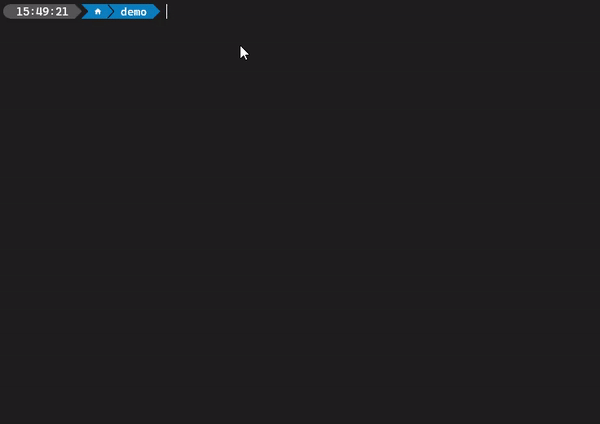

<div align="center">

[](https://docs.elgato.com/sdk)

# Stream Deck CLI

[](https://docs.elgato.com/streamdeck/cli)
[![Elgato homepage](https://img.shields.io/badge/Elgato-3431cf?labelColor=grey&logo=data:image/svg+xml;base64,PHN2ZyByb2xlPSJpbWciIHZpZXdCb3g9IjAgMCAyNCAyNCIgeG1sbnM9Imh0dHA6Ly93d3cudzMub3JnLzIwMDAvc3ZnIj48dGl0bGU+RWxnYXRvPC90aXRsZT48cGF0aCBmaWxsPSIjZmZmZmZmIiBkPSJtMTMuODgxOCA4LjM5NjQuMDI2MS4wMTk2IDkuOTQ5NCA1LjcxNzJjLS40ODg0IDIuNzI5LTEuOTE5NiA1LjIyMjMtNC4wMzg0IDcuMDI1M0ExMS45MjYyIDExLjkyNjIgMCAwIDEgMTIuMDk3IDI0Yy0zLjE5MjUgMC02LjE5MzktMS4yNDc3LTguNDUyNy0zLjUxNDRDMS4zODY4IDE4LjIxODguMTQyNyAxNS4yMDQ0LjE0MjcgMTJjMC0zLjIwNDIgMS4yNDQtNi4yMTg3IDMuNTAxNS04LjQ4NTRDNS45MDE5IDEuMjQ4IDguOTAzMiAwIDEyLjA5NyAwYzIuNDM5NCAwIDQuNzg0Ny43MzMzIDYuNzgzIDIuMTE4NyAxLjk1MjYgMS4zNTQgMy40NDY2IDMuMjM1NyA0LjMyMjcgNS40NDIyLjExMTIuMjgyOS4yMTQ5LjU3MzYuMzA1MS44NjU3bC0yLjEyNTUgMS4yMzU5YTkuNDkyNCA5LjQ5MjQgMCAwIDAtLjI2MTktLjg2OTRjLTEuMzU0LTMuODMwMy00Ljk4MTMtNi40MDQ4LTkuMDIzNy02LjQwNDhDNi44MTcxIDIuMzg4MyAyLjUyMiA2LjcwMDUgMi41MjIgMTJjMCA1LjI5OTUgNC4yOTUgOS42MTE1IDkuNTc0OCA5LjYxMTUgMi4wNTIgMCA0LjAwODQtLjY0NDIgNS42NTk2LTEuODY0NyAxLjYxNzItMS4xOTU1IDIuODAzNi0yLjgzMzcgMy40MzA5LTQuNzM2NGwuMDA2NS0uMDQxOUw5LjU5MDYgOC4zMDQ4djcuMjI1Nmw0LjAwMDQtMi4zMTM4IDIuMDYgMS4xODExLTUuOTk2MiAzLjQ2ODgtMi4xMi0xLjIxMjZWNy4xOTQzbDIuMTE3NC0xLjIyNDUgNC4yMzA5IDIuNDI3OS0uMDAxMy0uMDAxMyIvPjwvc3ZnPg==)](https://elgato.com)
[](https://discord.gg/GehBUcu627)
[](https://www.npmjs.com/package/@elgato/cli)
[](https://github.com/elgatosf/cli/actions)

</div>

## Installation

```
npm install -g @elgato/cli@latest
```

## Usage

```
Usage: streamdeck [options] [command]

Options:
  -v                            display CLI version
  -h, --help                    display help for command

Commands:
  create                        Stream Deck plugin creation wizard.
  link [path]                   Links the plugin to Stream Deck.
  restart|r <uuid>              Starts the plugin in Stream Deck; if the plugin is already running, it is stopped first.
  stop|s <uuid>                 Stops the plugin in Stream Deck.
  dev [options]                 Enables developer mode.
  validate [options] [path]     Validates the Stream Deck plugin.
  pack|bundle [options] [path]  Creates a .streamDeckPlugin file from the plugin.
  config                        Manage the local configuration.
  help [command]                display help for command

Alias:
  streamdeck
  sd
```

## Creating a Stream Deck plugin

The `streamdeck create` command enables you to scaffold a new Stream Deck plugin with ease. Running the command will initialize the creation wizard, and guide you through creating a new plugin.

<p align="center">
  
</p>

## Further Reading

-   Learn more about [Stream Deck CLI commands](https://docs.elgato.com/streamdeck/cli).
-   Read about [getting started with the Stream Deck SDK](https://docs.elgato.com/sdk).
